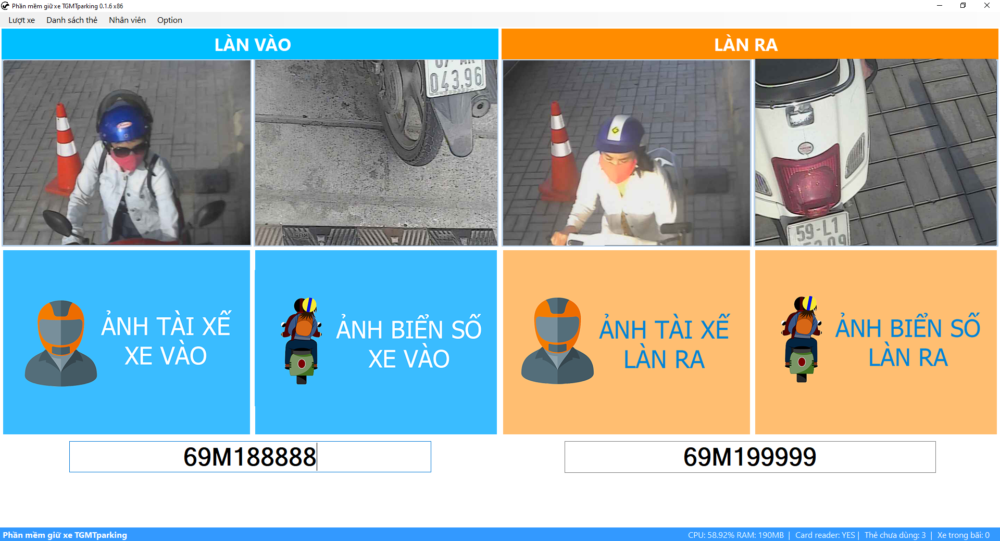

# TGMTparking

Source code phần mềm giữ xe nhỏ gọn với các tính năng cơ bản của 1 bãi giữ xe:
- 2 làn xe: làn vào và làn ra có thể hoán đổi cho nhau
- Tích hợp module đọc biển số xe máy [IPSSbike](https://github.com/viscomsolution/IPSSbike) (để sử dụng cần mua key)
- Tích hợp [TGMTplayer](https://github.com/vohungvi/TGMTplayer): thư viện đọc camera IP ít giật lag
- Sử dụng thẻ Mifare giá rẻ & dễ mua
- Lưu trữ CSDL vào database SQlite, dễ dàng copy chương trình qua PC mới
- Phân quyền người dùng: nhân viên và Admin. Admin có quyền setup camera, password database...
- Quản lý thẻ: thêm thẻ, báo mất thẻ (khóa thẻ), reset thẻ

## Yêu cầu kỹ thuật
- Chạy trên PC windows 10
- Camera IP các hãng: Ezviz, Hikvison, Vivotek, Vantech, KBvision.
- Đầu đọc thẻ Mifare SCL011
- Thẻ Mifare classic 13.56Mhz
- Cài đặt [.Net Framework 4.7.2](https://dotnet.microsoft.com/en-us/download/dotnet-framework/net472)
- Cài đặt [C++ redistributable 2015 x86](https://www.microsoft.com/en-us/download/details.aspx?id=48145) tùy phiên bản bạn chọn.

## Hướng dẫn sử dụng
- Tài khoản đăng nhập là **admin**, password là **admin**
- Trước khi sử dụng cần nạp thẻ vào danh sách thẻ
- Khi xe vào quẹt thẻ 1 lần để chụp ảnh
- Khi xe ra quẹt thẻ 1 lần để load ảnh lúc vào, nếu đúng thì quẹt thẻ 1 lần nữa để cho xe ra

## Các tính năng không kèm theo
- Điều khiển barrier
- Tính phí giữ xe
- Danh sách xe quen/vé tháng
- Key IPSSbike & IPSScar

Liên hệ: Mr Vĩ, [0939825125](tel:0939825125)